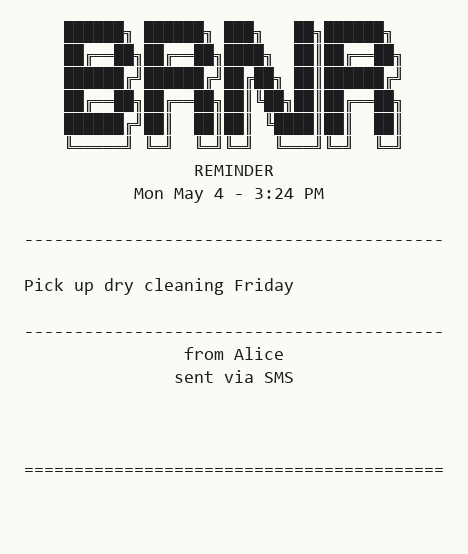
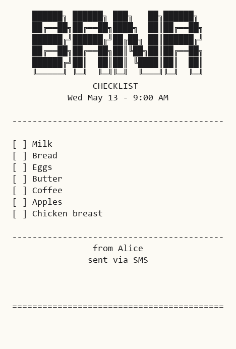
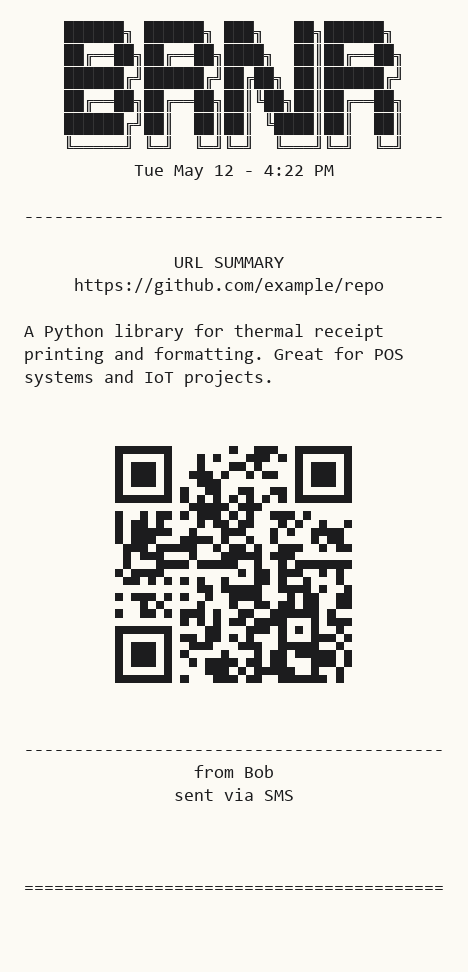
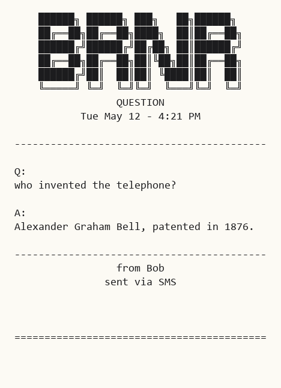
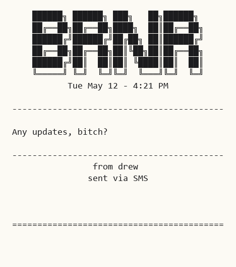

# PrintBot

PrintBot is a FastAPI service that takes incoming SMS (or Telegram) messages, asks a local Ollama model what they mean, and prints a formatted thermal-receipt response. It speaks ESC/POS to an Epson TM-T88V over the network, and ships with a full software simulator so you can build and demo without touching real hardware.

## What it looks like

The simulator drives the real ESC/POS pipeline in [app/printer.py](app/printer.py) and renders the resulting byte stream as a PNG that resembles thermal paper — so the previews below are produced by the actual print code, not hand-drawn mockups.

<table>
  <tr>
    <td align="center"><b>Reminder</b><br></td>
    <td align="center"><b>Checklist</b><br></td>
    <td align="center"><b>URL summary</b><br></td>
  </tr>
  <tr>
    <td align="center"><b>Question</b><br></td>
    <td align="center"><b>Generic</b><br></td>
    <td></td>
  </tr>
</table>

Regenerate locally:

```bash
python test_receipts.py --images                # all samples → docs/receipts/*.png
python test_receipts.py --reminder              # text-art for one intent
PYTHONIOENCODING=utf-8 python test_receipts.py  # on Windows for box-drawing glyphs
```

For a live preview while the service runs, point `PRINTER_IP=127.0.0.1` and start `python dev_printer.py` in another terminal.

## The pitch

Yes — this is software whose job is to print SMS messages on a thermal receipt printer. Here is the actual workflow it's built for:

1. **Buy a cheap receipt printer.** A used Epson TM-T88V on eBay is about $25–$40. Give it a good cleaning — there's a real chance the previous owner had it strapped under a counter at a juice bar, and the print head is gunky. Five minutes with isopropyl and a microfiber cloth and it's like new.
2. **Buy a burner Android phone.** Anything that boots and can hold a SIM. Pop in a prepaid line, install [SMS Gateway by capcom6](https://sms-gate.app/), and the phone becomes a webhook for incoming SMS. Park it on the same Wi-Fi as your host and forget it exists.
3. **Tunnel the webhook.** Run [cloudflared](https://github.com/cloudflare/cloudflared) on the host with a free `*.trycloudflare.com` tunnel pointing at port 8000 (or a Named Tunnel on your own domain if you want it durable). Paste that URL into SMS Gateway's webhook field. The burner can now reach PrintBot from anywhere a cell tower can reach the burner.
4. **Text the burner.**
   - Your todos for the day → printed as a checklist with empty boxes. Tick them by hand. Crumple when done.
   - A question you don't need an immediate answer to (*"who was the first US senator from Hawaii?"*) → Ollama answers on paper a few seconds later. No phone in hand, no rabbit hole, no eight more tabs.
   - A link to read later → prints a short summary and a scannable QR. A physical internet bookmark, in 2026.
   - Anything else → mirrored verbatim. The printer becomes a quiet inbox that doesn't notify, doesn't beep, and doesn't track you.

It's a deliberately friction-laden, deliberately physical inbox for the parts of using a phone you don't actually like. Worst case, you have a $30 receipt printer that occasionally prints groceries. Not the worst outcome.

## How it works

```
  SMS / Telegram  ─▶  FastAPI webhook  ─▶  Router  ─▶  Ollama (intent JSON)
                                              │
                                              ├─▶  Question context fetch (optional)
                                              ├─▶  Disk-backed job queue
                                              └─▶  ESC/POS printer  (or simulator)
```

The router classifies every message into one of five intents — `reminder`, `url`, `list`, `question`, or `generic` — using the system prompt in [prompts/system.txt](prompts/system.txt). The prompt is conservative: anything that isn't an explicit instruction falls through to `generic` and is mirrored back verbatim, so the printer doesn't invent tasks.

## Features

- **Multiple inbound sources**: SMS Gateway by capcom6 (local Android device, with HMAC signing), TextBee webhook, and a Telegram bridge that can preview & approve prints before they fire.
- **Ollama intent parsing** — runs locally, no cloud API, choose any model that returns clean JSON (`mistral` is the default).
- **Question grounding** — for `question` intents the router can fetch a small page snippet first so the model has real context, not just training data.
- **ESC/POS output** — Epson TM-T88V compatible; codepage and timezone configurable.
- **Software simulator** — `dev_printer.py` listens on port 9100 and renders receipts in your terminal exactly as they'd print.
- **Disk-backed job queue** with retry, dedup, and rate limiting (per-sender, sliding window with cooldown).
- **Outbound replies** — Telegram bridge can answer back to the sender by SMS via TextBee or SMS Gateway.
- **Docker + bare-metal** dev workflows.

## Quick start

1. Virtualenv + deps
   ```powershell
   python -m venv .venv
   .venv\Scripts\activate
   pip install -r requirements.txt
   ```
2. Config
   ```powershell
   copy .env.example .env
   ```
   Leave `TELEGRAM_*`, `TEXTBEE_*`, and `SMSGATE_*` blank to disable any source you don't use.
3. Start the simulator (terminal 1)
   ```powershell
   python dev_printer.py
   ```
4. Start PrintBot (terminal 2)
   ```powershell
   python app/main.py
   ```
5. Smoke test
   ```powershell
   curl http://localhost:8000/health
   curl -X POST http://localhost:8000/test/print -H "Content-Type: application/json" -d "{\"message\":\"remind me to call mom at 3pm\"}"
   ```

## API endpoints

| Method | Path | Purpose |
|---|---|---|
| `POST` | `/webhook/sms-gate` | Inbound from SMS Gateway by capcom6 (HMAC-verified if `SMSGATE_SIGNING_KEY` is set) |
| `POST` | `/webhook/textbee` | Inbound from TextBee (key-verified if `TEXTBEE_WEBHOOK_KEY` is set) |
| `POST` | `/test/print` | Manually classify + print a message |
| `POST` | `/test/photo` | Print a test photo / image fixture |
| `GET`  | `/queue/status` | Snapshot of pending/retry jobs |
| `POST` | `/queue/retry` | Force-retry queued jobs |
| `GET`  | `/health` | Liveness |

## Environment variables

The full list (with defaults) is in [.env.example](.env.example). The ones you'll touch most often:

- `OLLAMA_HOST`, `OLLAMA_MODEL`, `OLLAMA_KEEP_ALIVE`
- `PRINTER_IP`, `PRINTER_PORT`, `PRINTER_CODEPAGE`, `PRINTER_TIMEZONE`
- `RATE_LIMIT_MESSAGES`, `RATE_LIMIT_WINDOW_MINUTES`, `RATE_LIMIT_COOLDOWN_MINUTES`
- `MAX_MESSAGE_CHARS`
- `QUESTION_CONTEXT_ENABLED`, `QUESTION_CONTEXT_TIMEOUT_SECONDS`, `QUESTION_CONTEXT_MAX_CHARS`
- `TELEGRAM_BOT_TOKEN`, `TELEGRAM_CHAT_ID`
- `TEXTBEE_API_KEY`, `TEXTBEE_DEVICE_ID`, `TEXTBEE_WEBHOOK_KEY`
- `SMSGATE_BASE_URL`, `SMSGATE_USERNAME`, `SMSGATE_PASSWORD`, `SMSGATE_SIGNING_KEY`
- `CONTACTS_PATH` — optional JSON map from E.164 number to friendly label (see [contacts.sample.json](contacts.sample.json))

Don't commit secrets. `.env`, `config/`, and `.claude/` are all gitignored.

## Docker

```bash
docker compose up --build
```

Exposes port 8000 and reads env from your `.env`.

## Project layout

```
app/
  main.py            FastAPI app + webhook routes
  router.py          Intent classification, Ollama client, dispatch
  printer.py         ESC/POS encoder for real hardware
  mock_printer.py    ESC/POS encoder used when PRINTER_IP=127.0.0.1
  job_queue.py       Disk-backed queue with retry
  fetcher.py         URL fetch + question-context scrape
  question_context.py
  photo_fixtures.py
  telegram_bridge.py Long-poll Telegram bot for review-before-print
  smsgate_outbound.py / textbee_outbound.py   Outbound SMS clients
  logger.py
dev_printer.py       Simulator server + interactive composer
printer_simulator.py ESC/POS interpreter (used by the simulator)
test_receipts.py     Generates the sample receipts shown above
prompts/system.txt   Ollama system prompt — intents and guardrails
```

## Notes

- For real hardware, set `PRINTER_IP` to the printer's IP and restart. For local testing, set `PRINTER_IP=127.0.0.1` and run `dev_printer.py` alongside the app.
- The `question` intent uses Ollama's general knowledge by default. Setting `QUESTION_CONTEXT_ENABLED=true` makes the router do a quick web fetch first for grounding — slower but more accurate.
- The prompt explicitly resists reminder-creep ("I like waffles" is `generic`, not a reminder). If you tune the prompt, keep that guardrail.
